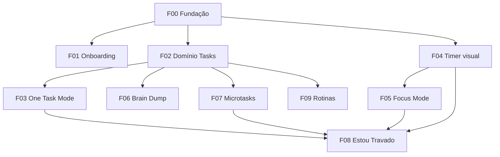

# Flux — Roadmap de Tasks (Pipeline)

> **Produto:** sistema de ativação mental (não todo app).  
> **North star:** reduzir a barreira para começar.  
> **Pipeline:** cada task abaixo vira um documento `TASK_READY` via `flutter-task-writer` antes de implementar.

## Legenda

| Campo | Significado |
|-------|-------------|
| **ID** | Identificador para `/flux` ou orquestrador |
| **Stitch** | `code.html` existente — obrigatório antes de implementar UI |
| **Deps** | Tasks que precisam estar concluídas antes |
| **Estimativa** | Tamanho relativo: S / M / L |

## Telas Stitch disponíveis hoje

| Stitch | Feature |
|--------|---------|
| `onboarding_bem_vindo/` | onboarding |
| `onboarding_triagem/` | onboarding |
| `home_one_task_mode/` | tasks — One Task Mode |
| `timer_modo_foco/` | focus |
| `estou_travado_micro_passos/` | tasks / focus |
| `brain_dump_captura_r_pida/` | tasks |
| `insights_estat_sticas_amig_veis/` | insights |
| `serene_focus/DESIGN.md` | tokens globais |

**Sem Stitch ainda (definir layout antes da task de UI):** rotinas, companion, energy mode, widgets, premium, modo crise, body doubling.

---

## Visão de dependências



---

## FASE 0 — Fundação (pré-requisito de tudo)

### F00 — Fundação do app

| | |
|---|---|
| **Objetivo** | Shell do app: tema Serene Focus, `go_router`, Isar, estrutura `lib/` |
| **Stitch** | `serene_focus/DESIGN.md` |
| **Deps** | — |
| **Estimativa** | L |

**Escopo**
- `lib/core/theme/` espelhando `DESIGN.md` (cores, tipografia Hanken Grotesk, radius, spacing)
- `lib/core/navigation/` com `go_router` e rotas placeholder por feature
- Setup Isar + `path_provider`; schemas vazios ou mínimos
- `main.dart` → `MaterialApp.router`
- Remover template counter demo

**Fora do escopo**
- Features de negócio
- Packages além de: `go_router`, `isar`, `isar_flutter_libs`, `path_provider`

**Critério de aceite**
- App abre com tema correto e navegação entre rotas stub
- `flutter analyze` limpo

---

## FASE 1 — MVP core (prioridade do produto)

Ordem sugerida de execução no pipeline: **F00 → F01 → F02 → F04 → F03 → F06 → F07 → F05 → F08 → F09**

### F01 — Onboarding

| | |
|---|---|
| **Feature** | `lib/features/onboarding/` |
| **Stitch** | `onboarding_bem_vindo/code.html`, `onboarding_triagem/code.html` |
| **Deps** | F00 |
| **Estimativa** | M |

**Escopo**
- Fluxo boas-vindas + triagem inicial (energia, objetivos leves — sem culpa)
- Persistir “onboarding completo” (Isar ou preferência local)
- Redirecionar para home após conclusão

**Fora do escopo**
- Login / conta
- Paywall

**UX anti-paralisia**
- Poucos passos; skip sempre visível; copy acolhedor

---

### F02 — Domínio e persistência de tarefas

| | |
|---|---|
| **Feature** | `lib/features/tasks/` (domain + data) |
| **Stitch** | N/A (camada de dados) |
| **Deps** | F00 |
| **Estimativa** | M |

**Escopo**
- Entidade `Task`: título, status, microtasks[], prioridade humana (enum), energia sugerida, timestamps
- Repository + UseCases: criar, listar inbox, obter “tarefa atual”, concluir, arquivar
- Isar collections e mappers
- Regra: **uma tarefa “ativa” por vez** (One Task Mode)

**Fora do escopo**
- UI de listas grandes
- Sync cloud
- IA

---

### F03 — One Task Mode (home)

| | |
|---|---|
| **Feature** | `lib/features/tasks/presentation/` |
| **Stitch** | `home_one_task_mode/code.html` |
| **Deps** | F02, F04 (timer rápido embutido) |
| **Estimativa** | L |

**Escopo**
- Tela com **uma** tarefa atual
- CTAs: Começar, Concluir, Quebrar tarefa, Estou travado
- Timer rápido (reusa F04)
- Zero listas / zero distrações
- Empty state gentil quando não há tarefa ativa

**Fora do escopo**
- Inbox completa
- Calendário

**Critério de aceite**
- Fidelidade visual ao `home_one_task_mode/code.html`
- Apenas uma tarefa visível como “agora”

---

### F04 — Timer visual (componente compartilhado)

| | |
|---|---|
| **Feature** | `lib/shared/` + `lib/features/focus/` (parcial) |
| **Stitch** | `timer_modo_foco/code.html` (círculo, progresso) |
| **Deps** | F00 |
| **Estimativa** | M |

**Escopo**
- Widget timer circular animado (`ValueNotifier` para tick/progresso)
- Presets: 2 / 5 / 10 min + pomodoro opcional
- Pausa rápida, haptics, sons suaves (assets locais simples)
- API reutilizável: `FocusTimerController` ou similar

**Fora do escopo**
- Tela fullscreen focus (F05)
- Sons premium (Fase 3)

**Performance**
- Rebuild só no anel do timer (`ValueListenableBuilder`)

---

### F05 — Focus Mode

| | |
|---|---|
| **Feature** | `lib/features/focus/` |
| **Stitch** | `timer_modo_foco/code.html` |
| **Deps** | F04, F02 |
| **Estimativa** | L |

**Escopo**
- Tela minimalista fullscreen
- Tarefa atual + timer visual (F04)
- Som ambiente básico (1–2 tracks MVP)
- Animações suaves; eliminar chrome desnecessário
- Entrada via “Começar” na home

**Fora do escopo**
- Body doubling
- Temas premium

---

### F06 — Quick Brain Dump

| | |
|---|---|
| **Feature** | `lib/features/tasks/` (captura) |
| **Stitch** | `brain_dump_captura_r_pida/code.html` |
| **Deps** | F02 |
| **Estimativa** | M |

**Escopo**
- Input instantâneo; salvar sem categoria
- Lista inbox separada da “tarefa atual”
- Ação: converter captura → tarefa
- Organização posterior (mover para ativa, arquivar)

**Fora do escopo**
- Captura por voz (placeholder UI ok; implementação real = task futura F06b)
- IA

**Task futura opcional:** **F06b — Brain Dump voz** (Fase 2+)

---

### F07 — Microtasks

| | |
|---|---|
| **Feature** | `lib/features/tasks/` |
| **Stitch** | `estou_travado_micro_passos/code.html` (parcial) |
| **Deps** | F02 |
| **Estimativa** | M |

**Escopo**
- CRUD de subtarefas manuais
- Progresso visual (x de y)
- Foco em ações pequenas (copy e UX)
- Quebrar tarefa abre fluxo de edição de microtasks

**Fora do escopo**
- Geração automática por IA (Fase 3)

---

### F08 — “Estou travado” (fluxo integrado)

| | |
|---|---|
| **Feature** | orquestra `tasks` + `focus` |
| **Stitch** | `estou_travado_micro_passos/code.html` |
| **Deps** | F03, F07, F04, F05 |
| **Estimativa** | L |

**Escopo**
- Botão na home → fluxo único:
  1. Sugerir/criar micro-passos (manual; templates leves ok)
  2. Reduzir complexidade (mostrar só o próximo micro-passo)
  3. Iniciar timer **2 min**
  4. Abrir Focus Mode
  5. Mensagem de incentivo gentil (sem culpa)
- Exemplo produto: “Estudar Flutter” → micro-ações concretas

**Fora do escopo**
- IA quebra automática

**Critério de aceite**
- Fluxo completo em &lt; 3 toques após “Estou travado”
- Nunca exibir streak ou punição

---

### F09 — Rotinas leves

| | |
|---|---|
| **Feature** | `lib/features/routines/` |
| **Stitch** | **Criar no Stitch antes da task** |
| **Deps** | F02 |
| **Estimativa** | M |

**Escopo**
- Templates: manhã, noite, trabalho, estudo
- Checklist simples (poucos passos fixos + customização leve)
- Marcar passo concluído; progresso visual
- Sem recorrência complexa no MVP (opcional: reset diário simples)

**Fora do escopo**
- Automação pesada
- Notificações (F16)

---

## FASE 2 — Retenção e adaptação

Ordem sugerida: **F12 → F13 → F14 → F15 → F11 → F10 → F16 → F17 → F18**

### F10 — Companion Mode

| | |
|---|---|
| **Stitch** | Definir no Stitch |
| **Deps** | F03 |
| **Estimativa** | M |

**Escopo**
- Mensagens acolhedoras contextuais (início, pausa, conclusão, reinício)
- Reforço positivo; lembretes suaves
- **Nunca:** culpa, pressão, streak tóxico

---

### F11 — Insights (estatísticas emocionais)

| | |
|---|---|
| **Stitch** | `insights_estat_sticas_amig_veis/code.html` |
| **Deps** | F02, F04, F05 |
| **Estimativa** | M |

**Escopo**
- Horários produtivos (agregação local)
- Tarefas concluídas, sessões de foco
- Padrões de energia (se F13 existir)
- Tom visual amigável, não dashboard corporativo

---

### F12 — Reinício sem culpa (cross-cutting)

| | |
|---|---|
| **Deps** | F03 |
| **Estimativa** | S |

**Escopo**
- Copy e estados: “Você pode recomeçar agora”
- Sem streak quebrado; sem badges punitivos
- Reset de sessão / tarefa pausada sem perder histórico agressivo

**Implementação**
- Preferência em strings + lógica em ViewModels (não feature isolada obrigatória)

---

### F13 — Energy Mode

| | |
|---|---|
| **Stitch** | Definir no Stitch |
| **Deps** | F02, F03 |
| **Estimativa** | M |

**Escopo**
- Usuário define: baixa / média / alta
- Filtrar ou sugerir próxima tarefa compatível
- Integrar com triagem onboarding (F01) se fizer sentido

---

### F14 — Prioridade inteligente (humana)

| | |
|---|---|
| **Deps** | F02 |
| **Estimativa** | S |

**Escopo**
- Substituir alta/média/baixa por: `fácil começar`, `rápido`, `exige energia`, `urgente`
- UI de seleção simples na criação/edição de tarefa
- Ordenação suave na sugestão de “próxima tarefa”

---

### F15 — Sessões curtas (presets globais)

| | |
|---|---|
| **Deps** | F04 |
| **Estimativa** | S |

**Escopo**
- Destacar 2 / 5 / 10 min em toda UI de timer
- Copy orientado a TDAH (“só 2 minutos”)

*Nota:* pode ser absorvido por F04 se já completo — evitar task duplicada.

---

### F16 — Notificações inteligentes

| | |
|---|---|
| **Deps** | F02, F03 |
| **Estimativa** | M |
| **Package** | `flutter_local_notifications` (autorizar na task) |

**Escopo**
- Tom gentil; opt-in
- Exemplos: “vamos tentar por 2 minutos?”, “quer continuar de onde parou?”
- **Nunca** agressivas

---

### F17 — Widgets Home Screen

| | |
|---|---|
| **Deps** | F03, F04, F09 |
| **Estimativa** | L |
| **Package** | `home_widget` ou equivalente (autorizar na task) |

**Escopo**
- Próxima tarefa
- Botão foco
- Timer rápido
- Rotina atual

---

### F18 — Fundação Premium (gate, sem IA)

| | |
|---|---|
| **Feature** | `lib/features/premium/` |
| **Deps** | F00 |
| **Estimativa** | M |

**Escopo**
- Flag `isPremium` local
- Paywall leve / restore placeholder
- Travas feature-flag para Fase 3

**Fora do escopo**
- Store real (task separada quando for publicar)

---

## FASE 3 — Premium, IA e expansão

| ID | Nome | Deps | Stitch | Est. |
|----|------|------|--------|------|
| F19 | IA quebra microtasks | F07, F18 | — | L |
| F20 | IA Companion (body double virtual) | F10, F18 | — | L |
| F21 | Sons premium | F05, F18 | — | M |
| F22 | Temas premium | F00, F18 | — | M |
| F23 | Backup cloud | F02, F18 | — | L |
| F24 | Insights avançados | F11, F18 | — | M |
| F25 | AI Task Coach | F19 | — | L |
| F26 | Modo crise / overwhelm | F03, F05 | Criar Stitch | L |
| F27 | Body doubling (sessões) | F05 | — | XL |
| F28 | Wearables (Watch / Wear OS) | F04, F03 | — | XL |

**F06b** — Brain Dump por voz  
**F29** — Integração loja (IAP / subscriptions)

---

## Explicitamente FORA do roadmap (não criar tasks)

- Chat
- Feed social
- Marketplace
- Tags complexas
- Dashboards enormes
- Calendário complexo
- Projetos corporativos / colaboração

---

## Como rodar o pipeline

Para cada ID (ex.: **F03**):

```
/flux Implementar task F03 — One Task Mode conforme docs/ROADMAP.md
```

O `flutter-task-writer` deve gerar documento completo em:

```
docs/tasks/F03-one-task-mode.md
```

(com `PIPELINE_STATUS: TASK_READY` no final).

---

## Matriz feature → task

| # Spec original | Task(s) |
|-----------------|---------|
| 1 One Task Mode | F03 |
| 2 Brain Dump | F06, F06b |
| 3 Focus Mode | F05 |
| 4 Timer visual | F04 |
| 5 Estou travado | F08 |
| 6 Microtasks | F07 |
| 7 Rotinas | F09 |
| 8 Companion | F10 |
| 9 Insights | F11, F24 |
| 10 Prioridade inteligente | F14 |
| 11 Energy Mode | F13 |
| 12 Sessões curtas | F04, F15 |
| 13 Reinício sem culpa | F12 |
| 14 Widgets | F17 |
| 15 Notificações | F16 |
| 16–21 Premium | F18–F24 |
| 22–25 Futuras | F25–F28 |
| Onboarding (Fase 1 lista) | F01 |
| Fundação | F00 |

---

## Próximo passo recomendado

1. **F00** — sem isso, nenhuma feature entra no pipeline com review consistente.  
2. **F01** — onboarding (Stitch pronto).  
3. **F02 → F04 → F03** — núcleo “uma tarefa + timer”.

Quando quiser implementar, diga por exemplo:

```
/flux F00 Fundação do app
```
